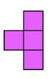
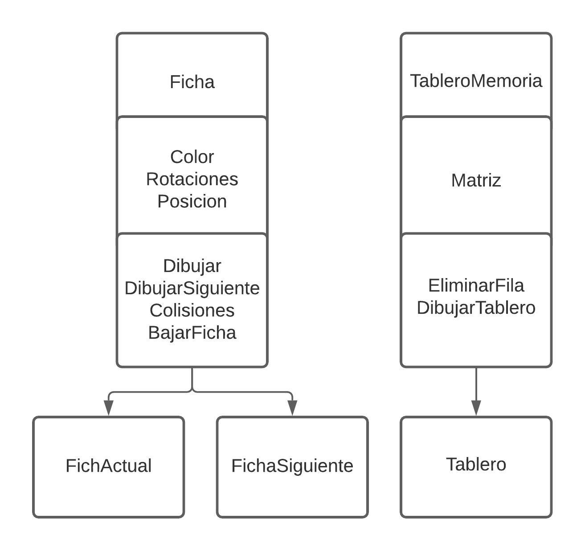

# Tetris: Programación orientada a objetos
___

El objetivo de este trabajo es emplear el paradigma de programación orientada a objetos para implementar un juego basado en tetrominos como lo es el tetris, por medio de la herramieta de Processing que usa java como lenguaje de programación.
En este tetris los tetrominos y sus rotaciones son representados como enteros de los cuales sus digitos en binario forman una matriz 4x4 tal que cada bit con valor de 1 es un cuadro del tetromino, por ejemplo:
```processing
      [0  1  0  0]
19520=[1  1  0  0] 
      [0  1  0  0]
      [0  0  0  0]
```
Que representa el siguiente tetromino:
<p align="center"></p>

## Clases:
La estructura del tetris desarrollado se basa en 2 clases principales, la clase Ficha y la clase TableroMemoria. A continuación tenemos un diagrama que ilustra estas clases, sus atributos, sus métodos y lo objetos creados de cada uno.
<p align="center"></p>

### Tablero:
La clase TableroMemoria solo cuenta con un atributo, una matriz de colores de 10x21.La última fila de la matriz es de 1 y lo demás de 0, esto para que se pueda identificar cual es la parte de abajo del tablero. 

El método EliminarFFila recorre desde abajo una a una las filas de la matriz e identifica si alguna de ellas está completa, si esto ocurre la elimina y baja todas las filas enores a esta.
```Processing
void EliminarFila(){
    for (int i=19; i >=0; i--) {
      FilaCompleta= true;
      for (int j=0; j < 10; j++) {
        if (matriz[i][j]==0){
          FilaCompleta= false;
        }
      }
      if (FilaCompleta == true){
        FilasCompletadas++;
        for (int k=i; k >0; k--) {
          matriz[k]=matriz[k-1];
        }
      }
    }
  }
```
El método DibujarTablero recorre la matriz y si encuentra algún color diferente de negro, dibuja un cuadrado del color y posición coorespondiente en el tablero.
```Processing
  void DibujarTablero(){                                          //Recorremos cada celda y dibujamos un rectangulo con el color que esta guarda
    for (int i=0; i < 20; i++) {
      for (int j=0; j < 10; j++) {
        fill(matriz[i][j]);
        square(j*30 +30, i*30 + 30, 30);
      }
    }
  }
```

Solo es necesario crear un objeto de esta clase, que representará al tablero durante todo el juego.
```Processing
  Tablero = new TableroMemoria();
```
### Ficha:
El constructor de la clase Ficha es de la forma `Ficha(int valor){}`, este valor que recibe está dado por un número aleatoreo del 1 al 7, que es el que me indica cual es la lista de rotaciones correspondiemtes al tetromino y su color.
La clase Ficha tiene los siguientes métodos:

El método dibujar recorre la representación binaria del tetromino indicado y lo dibuja en el tablero en las coordenadas `x` y `y`, a su vez con estas coordeenadas verifica que el tetromino no se salga del tablero.
```Processing
void Dibujar() {
    int q=0;
    MovDerecha = true;
    MovIzquierda = true;
    RotacionDerecha = false;
    push();
    fill(Color);
    for (int i = 0; i <= 16; i++) {
      if ((Rotaciones[rotacion] & (1 << 15 - i)) != 0) {
        Posicion[q]=(((i / 4) | 0) + 1 +y );                     //agrego la posición en la matriz tablero de cada cuadrado del Tetromino
        Posicion[q+1]=((i % 4)+x+4);
        if (((i % 4)+x+4)<MaximaPosicion){                       //Verifico si la ficha no está a la derecha del todo para que pueda rotar
          RotacionDerecha = true;
        }
        if (((i % 4)+x+4)==9){                                   //Si algun cuadrado del tetromino está en el limite a der o izq no lo dejo moverse más
          MovDerecha = false;
        } else if (((i % 4)+x+4) == 0){
          MovIzquierda = false;
        }
        q+=2;
        rect(((i % 4)+x+5)*30, (((i / 4) | 0) + y+1)*30, 30, 30);
      }
    }
      pop();
  }
```
El método DibujarSiguiente toma solo una de las rotaciones del tetromino y la dibuja en la parte derecha del tablero para facilidad del jugador.
```Processing

  void DibujarSiguiente(){                                       //Dibujo el tetromino que sigue a la derecha del tablero
    for(int p=0; p<8; p++){
      push();
      fill(Color);
      for (int i = 0; i <= 16; i++) {
        if ((Rotaciones[0] & (1 << 15 - i)) != 0) {
          rect(((i % 4)+13)*30, (((i / 4) | 0) + 2)*30, 30, 30);
        }
      }
      pop();
    }
  }
```
El método Colisiones verifica si la siguiente posición que ocupará el tetromino, ya sea hacia abajo o a los lados, está ocupada en la matriz del tablero, para no dejarlo mover más. Si se presentan colisiones en la parte inferior, el color del tetromino se guarda en las posiciones del tablero y se inicializan todas las variables de nuevo. El método Colisiones también verifica si la colisión se da en la primera fila, si es así se considera terminada la partida y se cambia el valor de `juego` a `false`
```Processing

  void Colisiones(TableroMemoria tab){
    
    //Verifica si en las posiciones siguientes habrán colisiones
    if ((tab.matriz)[Posicion[0]+1][Posicion[1]]!=0 | (tab.matriz)[Posicion[2]+1][Posicion[3]]!=0  | (tab.matriz)[Posicion[4]+1][Posicion[5]]!=0  | (tab.matriz)[Posicion[6]+1][Posicion[7]]!=0 ){
      BajarCompleto=true;
      x=0;
      y=0;
      rotacion=0;
      Tetromino= SiguienteTetromino;
      SiguienteTetromino = (int)random(7);
      for(int i=0; i<8; i+=2){                                              // Guarda los colores de la ficha en la matriz tablero
        tab.matriz[Posicion[i]][Posicion[i+1]] = Color;
      }
      tab.EliminarFila();
      for(int s=0; s<8; s+=2){                                              //Verificamos si el espacio para que salga el nuevo tetromino está libre, si no es así es game over
        if (Posicion[s]==1){
          juego = false;
          image(GameOver, 30, 30, 300, 600);
          textSize(40);
          fill(255);
          text(Puntaje, 130, 270);
        }
      }
    }
    
    //Verificamos si hay colisiones a la derecha
    if (MovDerecha== true && (tab.matriz)[Posicion[0]][Posicion[1]+1]!=0 | (tab.matriz)[Posicion[2]][Posicion[3]+1]!=0  | (tab.matriz)[Posicion[4]][Posicion[5]+1]!=0  | (tab.matriz)[Posicion[6]][Posicion[7]+1]!=0 ){
      MovDerecha= false;
    }
    //Verificamos si hay colisiones a la izquierda
    if (MovIzquierda== true && (tab.matriz)[Posicion[0]][Posicion[1]-1]!=0 | (tab.matriz)[Posicion[2]][Posicion[3]-1]!=0  | (tab.matriz)[Posicion[4]][Posicion[5]-1]!=0  | (tab.matriz)[Posicion[6]][Posicion[7]-1]!=0 ){
      MovIzquierda= false;
    }
  }
```
El método bajar la ficha se ejecuta cuando el jugador presiona la flecha hacia abajo, este hace que la ficha se desplace directamente hacia abajo hasta el lugar más bajo posible
```Processing

  //Bajar la ficha a la máxima posicion
  void BajarFicha(){
    BajarCompleto = false;
    while (BajarCompleto == false){
      y++;
      FichaActual.Dibujar();
      FichaActual.Colisiones(Tablero);
    }
  }
}
```
De esta clase se crearon 2 objetos.
```Processing
  FichaActual = new Ficha(Tetromino);
  FichaSiguiente = new Ficha(SiguienteTetromino);
```
Siendo Tetromino y SiguienteTetromino los números aleatoreos que me definen las fichas.
